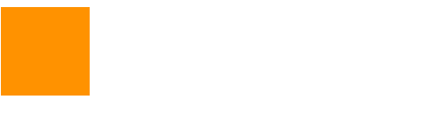
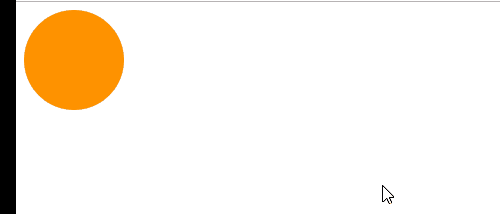
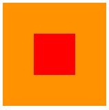
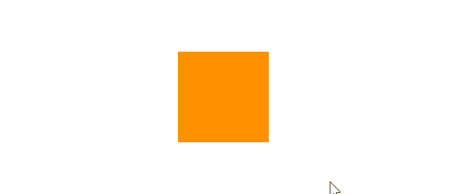
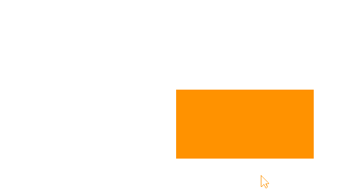
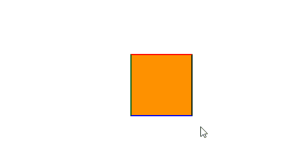
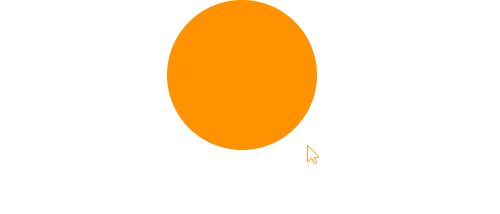
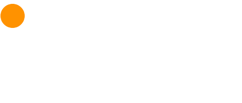

# 过渡 ( transition )
过渡属性用法： transition : ransition-property  transition-duration  transition-timing-function transition-delay

 transition-property : 规定设置过渡效果的 CSS 属性的名称(如：width,height,all)。
 transition-duration : 规定完成过渡效果需要多少秒或毫秒。
 transition-timing-function : 规定速度效果的速度曲线。
    取值：
    ease 逐渐变慢（默认值）
	linear 匀速
	ease-in 加速
	ease-out 减速
	ease-in-out  先加速后减速
 transition-delay	定义过渡效果何时开始（延迟多长时间）。

 ```
 .transition{
     width: 100px;
     height: 100px;
     background: #f90;
     transition: width 2s ease-in-out;
 }
 .transition:hover{
     width: 500px;
 }

 <div class="transition"></div>
 ```
 实现的效果:


# 变形 ( transform )
## 2D 变形
### 移动 ( translate )
移动可以指定像素值也可以指定百分比，注意：指定百分比是自身大小的百分比，因此可以用于设置盒子定位时的居中对齐（在设置left：50%后再移动自身的-50%即可）
```
.translate {
    width: 100px;
    height: 100px;
    border-radius: 50%;
    background: #f90;
    transition: all 2s;
}
.translate:hover {
    transform: translate(300px, 100px);
}
<div class="translate"></div>
```
 实现的效果:


```
 .translate-father {
    width: 150px;
    height: 150px;
    background: #f90;
    transition: all 0.5s;
    position: relative;
}
.translate-son{
    background-color: red;
    position: absolute;
    left: 50%;
    top: 50%;
    width: 60px;
    height: 60px;
    transform: translate(-50%, -50%);
}
<div class="translate-father">
    <div class="translate-son"></div>
</div>
```
 实现的效果:


### 缩放 scale（x，y）
x,y设置大于1 是放大，小于1 是缩小。
```
.scale{
    width: 100px;
    height: 100px;
    background: #f90;
    margin: 200px auto;
    transition: all 2s;
}
.scale:hover{
    transform: scale(0.5, 2);
}
<div class="scale"></div>
```
 实现的效果:


### rotate (x deg)
x指定度数值，正数是顺时针旋转，负数是逆时针旋转。
旋转可以使用transform-origin 指定旋转中心点，transform-origin 给left top right bottom 也可以指定具体的像素值
```
.rotate{
    width: 200px;
    height: 100px;
    background: #f90;
    margin: 200px auto;
    transition: all 2s;
    transform-origin: bottom left;
}
.rotate:hover{
    transform: rotate(-120deg);
}
<div class="rotate"></div>
```
 实现的效果:


### skew（x deg ,y deg）
x,y分别指定倾斜在x，y方向上的角度，可以为负数。y值不写默认为0。
```
.skew{
    width: 100px;
    height: 100px;
    background: #f90;
    border: 2px solid #fff;
    border-top-color: red;
    border-left-color: green;
    border-right-color: black;
    border-bottom-color: blue;
    transition: all 1s;
    margin: 200px auto;
}
.skew:hover{
    transform: skew(30deg,-50deg);
}
<div class="skew"></div>
```
 实现的效果:


## 3D 变形
### 旋转（rotateX,rotateY,rotateZ）
3D旋转与2D类似，只不过一个是基于二位坐标一个是基于三维坐标。三个值可以同时指定也可以单独指定。
```
.rotate{
    width: 200px;
    height: 100px;
    background: #f90;
    margin: 200px auto;
    transition: all 2s;
    transform-origin: bottom left;
}
.rotate:hover{
    transform: rotateY(180deg);
}
<div class="rotate"></div>
```
 实现的效果:


### 移动（translateX，translateY，translateZ）
3D移动对于xy方向上的移动与2d移动一致。只有z方向上的移动不一样。Z方向上的移动在现实生活中是距离变远，距离变近。因此在网页中显示结果是变近则变大，变远则变小
 要使Z放线上移动生效首先要设置perspective（眼睛距离屏幕的距离）
 ```
 body{
    perspective: 1000px;
    /* 数值越小说明眼睛离的越近 */
}
.translate{
    width: 150px;
    height: 150px;
    border-radius: 50%;
    background: #f90;
    transition: all 0.5s;
    margin: 200px auto;
}
.translate:hover{
    transform: translate3d(0, 0, 200px);
}
<div class="translate"></div>
 ```
  实现的效果:
 

 # 动画 animation
 animation : animation-name || animation-duration || animation-timing-function || animation-delay || animation-iteration-count || animation-direction || animation-fill-mode
 animation-name : 动画名称（自己使用@keyframes 定义的动画）
 animation-duration : 持续时间
 animation-timing-function : 运动曲线，与过渡的运动曲线类似。
 animation-delay : 延迟时间
 animation-iteration-count : 循环次数 （infinite 是无限循环）
 animation-direction　: 是否反向（动画是否是由结尾倒开是倒着放的）
 animation-fill-mode : 设置在动画播放之外的状态（结束时的状态）none | forwards（设为结束时的状态）| backwards(设为开始时的状态)| both（设为开始或结束时的状态）
 animation-play-state : 设置动画状态 running 开始 | paused 暂停
 ### @keyframes 自定义动画
 ```
 .animation{
     width: 50px;
     height: 50px;
     background: #f90;
     animation: move 3s linear 2s;
     border-radius: 50%;
 }
 @keyframes move {
     0% {
         transform: translate3d(0,0,0);
     }
     25% {
         transform: translate3d(0,150px,0);
     }
     50%{
         transform: translate3d(350px,150px,0);
     }
     75%{
         transform: translate3d(350px,0,0);
     }
     100%{
         transform: translate3d(0,0,0);
     }
 }
 <div class="animation"></div>
 ```
   实现的效果:
  