本文出处[(Chinese Window Lattice And CSS)](https://yuanchuan.dev/2019/05/15/window-lattice-and-css.html)

> 谁向云端着此亭，檐前树木映窗棂。
> -- 释绍嵩《陪赵知府登桃岭山亭》

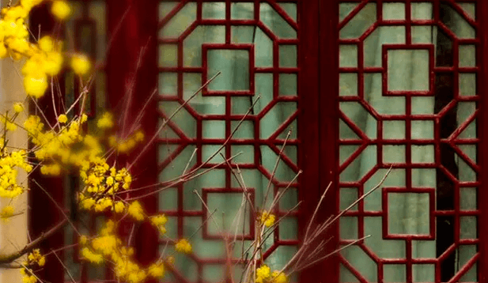

<!-- more -->
中国传统窗格具有对称美，还有一个非常美丽的正式名称——窗棂
作为一个css爱好者，我一直想用css绘制出它们。但这从来都不容易。我想使用SVG可能简单易懂知道我学习了如何使用 -webkit-box-reflect 属性。

# 属性(The property)

不幸的是，-webkit-box-reflect 是非标准的。标准的方式是使用element()函数，该函数已经在firefox中实现。
老实说-webkit-box-reflect属性在我看来是非常简洁的，应为它有很好的命名和它不依赖于额外的id像element()。我不知道为什么css工作组不接受它。
这是一篇关于css中反射的详细文章，以及Ana Tudor从2016年开始的几个演示。

# 趋势(Directions)

这个-webkit-box-reflect属性提供四个反射方向：上、下、左和右。如何使用它:
```
.bos{
    -webkit-box-reflect:above|below|left|right;
}
```
也许因为从一开始它这是一个实验性的属性，所以还没有办法同时给一个元素增加多个反射。

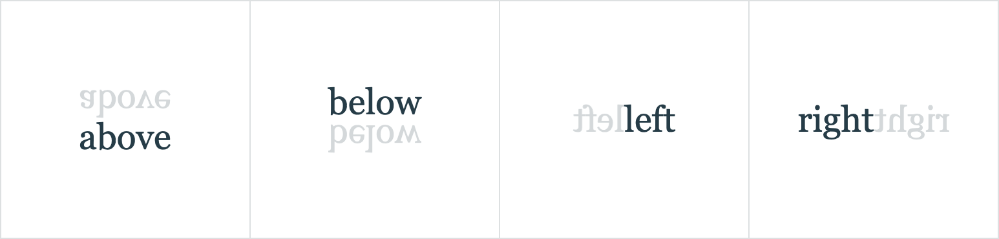

我认为不同成俗的多次反射比只有4次反射的反射要酷的多！

它令人兴奋
让我们开始使用一个单一的div元素和它在右边的反射。
```
<div>△</div>
<style>
    div{
        -webkit-box-reflect:right;
    }
</style>
```

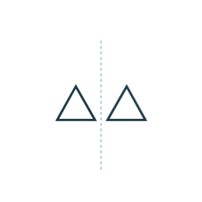

# 如何增加其他的反射？(How to add another reflection?)

不久前，ChrisCoyier在本文中介绍了一个技巧，通过应用放置阴影于父节点，将阴影添加到剪裁元素中。
我们可以通过添加父节点并对其设置反射来做类似的事情。
```
<div class="parent">
  <div class="box">△</div>
</div>

<style>
  .box {
    -webkit-box-reflect: right;
  }
  .parent {
    -webkit-box-reflect: below;
  }
</style>
```

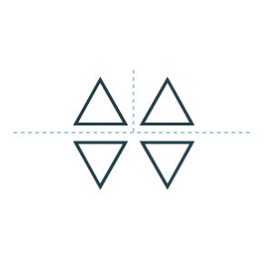

它像一张展开的纸，首先分成两半从左到右，然后从上到下。但是，顺序并不重要。
尽管没有得到我们想要的精确的结果，找到一种添加多种反射的方式也令我们兴奋。

# 继续深入(Going deep)

这个总数程指数形式增长，这取决于嵌套div的深度。
因此像上面有2个嵌套的div，它们将得到2^2=4个元素（包括所有的反射）。有7个它们将是2^7=128个元素。

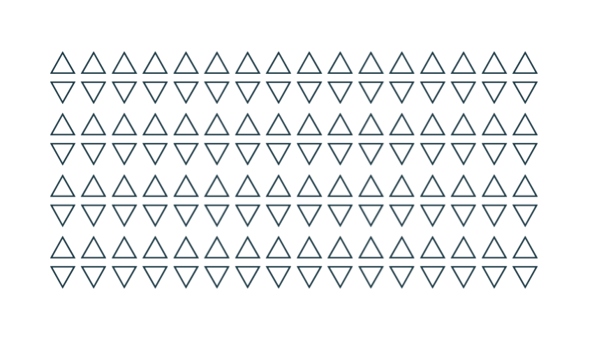

# 起源(Seed)

最深处的div作为起源。因为由反射组成的整个图形将随它而改变。
举个例子，旋转-45度：
```
<div>
    <div>
      <div class="seed">△</div>
    </div>
</div>

<style>
  /* ... */
  .seed {
    /* ... */
    transform: rotate(-45deg);
  }
</style>
```

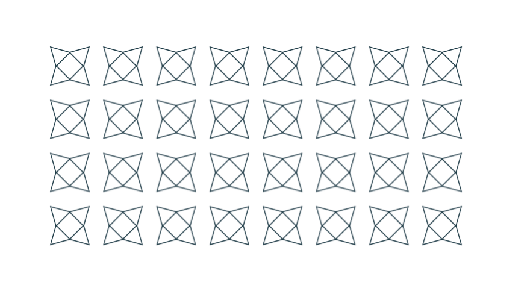

或结合一个其他属性及旧方法。这似乎也是另外一种构建Unicode模式不同的方法。
 


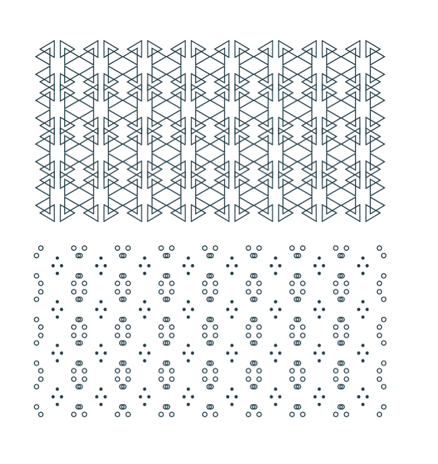

# 中国窗棂(Chinese Window Lattice)

因此，使用-weblit-box-reflect属性和上述描述的技术，我们可以使用很少的代码在css中画出这些对称的窗棂。
我想以本文的开始图片为例，让我们看看如何一步一步的画出它们。

## 1、元素的起源(The seed element)

首先，找出最小的元素不能进行分割，这里我们从左上角的部分作为起点。

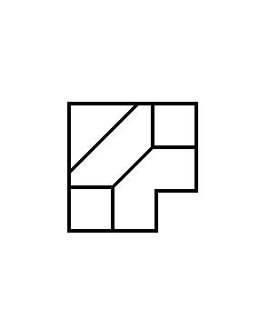

然后用 background linear-gradient 绘制这些线。为简单起见，使用空选择器作为种子元素。
```
<div></div>

<style>
  div:empty {
    width: 72px; height: 72px;
    --g: linear-gradient(#000, #000);
    --gs: linear-gradient(-45deg,
      transparent calc(50% - 1px), #000 calc(50% - 1px),
      #000 calc(50% + 1px), transparent calc(50% + 1px)
    );
    background:
      var(--g) 0 0 / 100% 2px,       var(--g) 100% 0 / 2px 48px,
      var(--g) 100% 48px / 24px 2px, var(--g) 48px 100% / 2px 24px,
      var(--g) 0 100% / 48px 2px,    var(--g) 0 0 / 2px 100%,
      var(--g) 0 46px / 24px 2px,    var(--g) 24px 100% / 2px 26px,
      var(--g) 100% 24px / 26px 2px, var(--g) 46px 0 / 2px 24px,
      var(--gs) 50% 50% / 24px 24px, var(--gs) 0 0 / 40px 40px;
    background-repeat: no-repeat;
  }
</style>
```

## 2. 添加反射(Add reflection)

反射从种子元素本身开始。我们选择“右边”作为初始方向，并使用自定义属性使其更直观。
```
<div style="--reflect: right -3px"></div>
<style>
  div {
     width: 72px;  height: 72px;
    -webkit-box-reflect: var(--reflect);
  }
  div:empty {
    /* ... */
  }
</style>
```

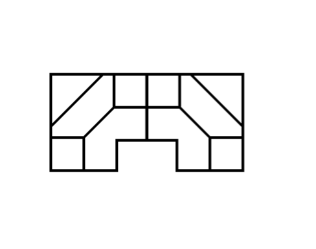

## 3. 继续展开(Continue unfolding)

所以我们要添加父节点来进行更多的反射。如果你把它看成是展开一张纸，那就真的有助于理解。
```
<div style="--reflect: below -2px">
  <div style="--reflect: right -3px"></div>
</div>
```

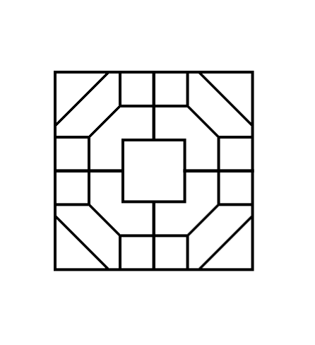

# 再加一个(Add another one.)
```
<div style="--reflect: below calc(200% - 6px)">
  <div style="--reflect: below -2px">
    <div style="--reflect: right -3px"></div>
  </div>
</div>
```

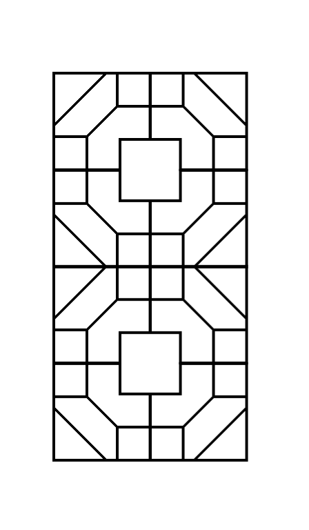

重复这个过程直到我们得到想要的结果。
```
<div style="--reflect: right calc(600% - 14px)">
  <div style="--reflect: right calc(200% - 6px)">
    <div style="--reflect: below calc(400% - 10px)">
      <div style="--reflect: below calc(200% - 6px)">
        <div style="--reflect: below -2px">
          <div style="--reflect: right -2px"></div>
        </div>
      </div>
    </div>
  </div>
</div>
```

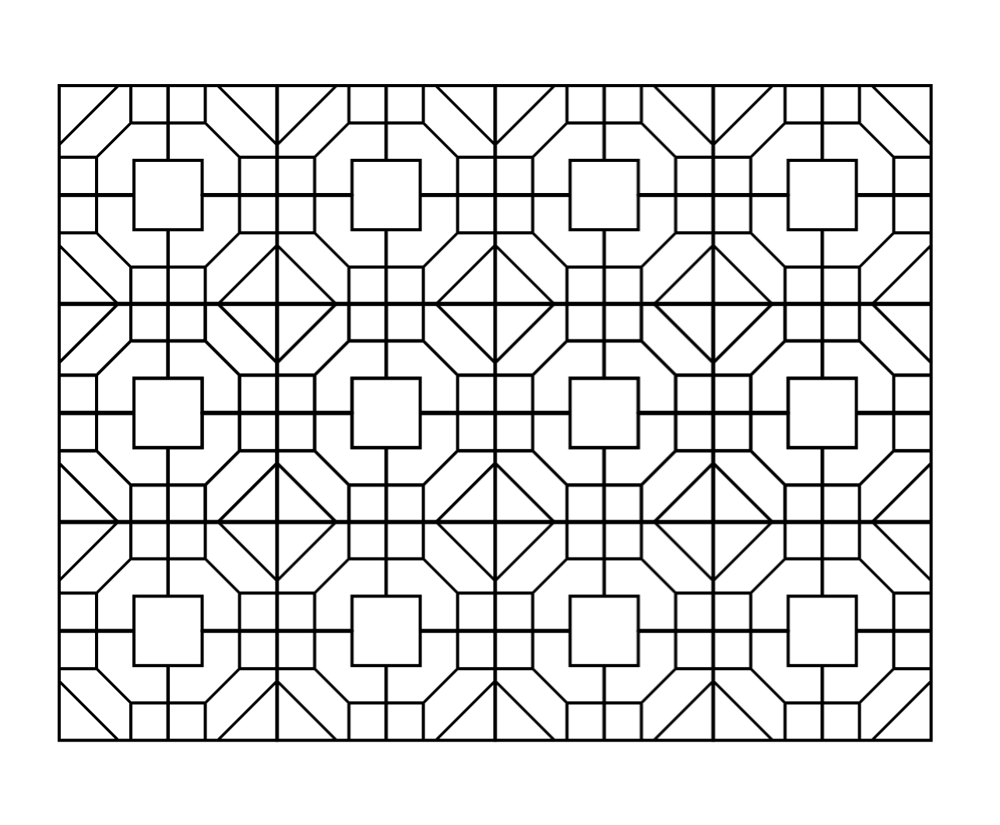

That's it.
您可以在[CodePen](https://codepen.io/fuzhen/pen/RzGzEM)上看到结果和完整的源代码。但它只在Chrome和Safari中有效。

# 结论
使用-webkit box reflect属性的解决方案在某种程度上很漂亮。我真希望它能被接受为一个标准，甚至能在各个方面做反射。这样就有可能在CSS中做剪纸（中国剪纸艺术）。