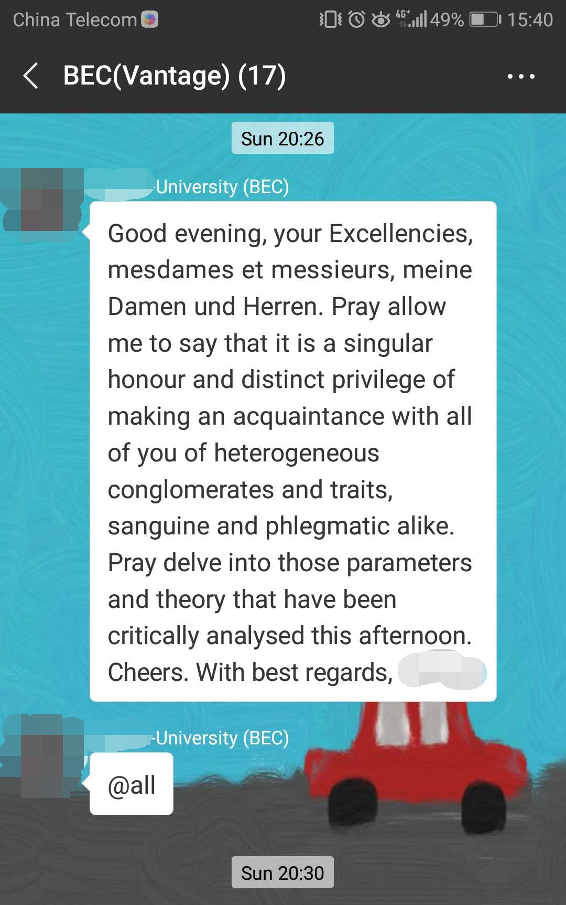

# 吐槽一下我的培训班的英语老师

9月2号我的英语班级开班，去上第一天课。满怀憧憬，提前一天预演了一下我的自我介绍（自我感觉良好，心里美滋滋）。在去上课的地铁上还在纠结到底要不要介绍我什么时候毕业、什么时候工作的要不要辣莫细呢？
<!-- more -->
教室不是特别大，坐在教室里没一会老师进来了。一直到他开口前面部都没有任何表情（给人一种不苟言笑的感觉），心里默念辣莫高冷。开始让我们自我介绍，让我们分别介绍教育、英文等级、等等。之前根本没有打算介绍教育背景、英文等级，都没有任何准备，打得我一个措手不及。中途还有很多人会日语，老师也用日语跟学生交流（我听不懂，我日语也就只知道五十音图）？？？？介绍完后老师说既然大家都没有太高的等级，就把英语的语速降低点。老师上来真的语速慢了很多（暖暖的很贴心）。

后来可能是为了调节课堂气氛，讲了一大串英文语速特别快。全程没有听明白说的啥（黑人问好脸）偶尔还会给我们蹦出一大串日语和法语，他是切换的毫无破绽我们也是听得毫无破绽。我都觉得我之前的英文全都白学了。为什么我什么都听不懂，我明明最近一直都在背单词听听力。

老师的语速快起来真的没边，从没有读过的文章到手就很6666666的语速。

老师的会的语言真是数不胜数，法语、韩语、日语、英语、四川话、东北话、上海话（其中还包括我很多没有听明白的语言，这些也不是都听出来的，看他朋友圈看到的）他说他之前一起带过英语和日语的培训班（用英语讲日语，佩服的五体投地）

这是下课后老师在群里给我们发的一段话，当时看到就没往下看了，有点怀疑这是英语吗？然后查字典找单词的意思，勉强翻译出了这句话（心碎了一地）

打击了我的自信心也激发了我的斗志（加油）