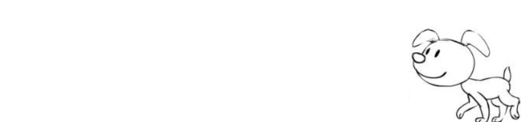

 今天是2018年的中秋佳节，在这里先祝福大家：千好万好事事好，月圆情圆人团圆！

 因为下载了一个screenToGif软件，录制gif动图停不下来

# 跟随鼠标移动的小狗狗

## js
```
!function(){
        class DogAnimation {
            constructor (canvas) {
                this.canvas = canvas;
                canvas.width = window.innerWidth;
                window.onresize = () => canvas.width = window.innerWidth;
                canvas.height = 200;
                //记录上一帧的时间
                this.lastWalkingTime = Date.now();
                //记录当前画的图片的索引
                this.keyFrameIndex = -1;
                this.ctx = this.canvas.getContext("2d");
                //图片目录
                this.RES_PATH = "./dog";
                this.IMG_COUNT = 8;
                this.dog = {
                    //一步10px
                    stepDistance: 9,
                    //小狗的速度
                    speed: 0.15,
                    //鼠标的x坐标
                    mouseX: -1,
                    //往前走停留的位置
                    frontStopX: -1,
                    //往回走停留的位置
                    backStopX: window.innerWidth,
                };
            }
            async start () {
            //等待志愿加载完
            await this.loadResources();
            this.pictureWidth = this.dogPictures[0].naturalWidth / 2;
            this.dog.mouseX = window.innerWidth - this.pictureWidth;
            this.recordMousePosition();
            window.requestAnimationFrame(this.walk.bind(this));
        }
            //记录鼠标位置
            recordMousePosition() {
                window.addEventListener("mousemove", event => {
                    //如果没有剪掉图片的宽度，小狗就跑到鼠标后面去了，因为图片的宽度还要占去空间
                        this.dog.frontStopX = event.clientX - this.pictureWidth;
                this.dog.backStopX = event.clientX;
            });
                window.addEventListener("touchstart", event => {
                    this.dog.frontStopX = event.touches[0].clientX
                    - this.pictureWidth;
                this.dog.backStopX = event.touches[0].clientX;
            });
            }
            //加载图片
            loadResources () {
                //存放加载后狗的图片
                let imagesPath = [];
                //准备图片的src
                for (let i = 0; i <= this.IMG_COUNT; i++) {
                    imagesPath.push(`${this.RES_PATH}/${i}.png`);
                }
                let works = [];
                imagesPath.forEach(imgPath => {
                    //图片加载完成后触发Promise和resolve
                    works.push(new Promise(resolve => {
                        let img = new Image();
                img.onload = () => resolve(img);
                img.src = imgPath;
            }));
            });
                return new Promise(resolve => {
                    //借助Promise.all知道了所有图片都加载好了
                    Promise.all(works).then(dogPictures => {
                    this.dogPictures = dogPictures;
                resolve();
            });
            });//这里再套一个Promise是为了让调用者能够知道处理好了
            }
            walk () {
                let now = Date.now();
                //计算位移 = 时间 * 速度
                let diffDistance = (now - this.lastWalkingTime)
                    * this.dog.speed;
                if (diffDistance < this.dog.stepDistance) {
                    //给下一帧注册一个函数
                    window.requestAnimationFrame(this.walk.bind(this));
                    return;
                }
                //获取下一张图片的索引
                this.keyFrameIndex = ++this.keyFrameIndex % this.IMG_COUNT;
                //direct表示小狗的方向；stopWalking表示小狗是否停下来
                let direct = -1, stopWalking = false;
                //如果鼠标在狗的前面则往前走
                if (this.dog.frontStopX > this.dog.mouseX) {
                    direct = 1;
                }
                //如果鼠标在狗的后面则往后走
                else if (this.dog.backStopX < this.dog.mouseX) {
                    direct = -1;
                }
                //如果鼠标在狗的位置
                else {
                    stopWalking = true;
                    //如果鼠标在小狗图片中间的右边，则direct为正，否则为负
                    direct = this.dog.frontStopX === -1 ? -1 :
                        this.dog.backStopX - this.dog.mouseX
                        > this.pictureWidth / 2 ? 1 : -1;
                    //如果停住的话用0.png
                    this.keyFrameIndex = -1;
                    //this.dog.mouseX = this.dog.stopX;
                }
                let ctx = this.ctx;
                //清掉上次画的内容
                ctx.clearRect(0, 0, this.canvas.width, this.canvas.height);

                ctx.save();
                //如果没有停，计算位置的时候乘以direct
                if (!stopWalking) {
                    this.dog.mouseX += this.dog.stepDistance * direct;
                }
                if (direct === -1) {
                    //左右翻转绘制
                    ctx.scale(direct, 1);
                }
                let img = this.dogPictures[this.keyFrameIndex + 1];
                let drawX = 0;
                //左右翻转绘制的位置需要计算一下
                drawX = this.dog.mouseX * direct -
                    (direct === -1 ? this.pictureWidth : 0);
                ctx.drawImage(img, 0, 0, img.naturalWidth,
                    img.naturalHeight,drawX, 20, 186, 162);
                ctx.restore();
                this.lastWalkingTime = now;
                //继续给下一帧注册一个函数
                window.requestAnimationFrame(this.walk.bind(this));
            }
        }
        let canvas = document.querySelector("#dog-walking");
        let dogAnimation = new DogAnimation(canvas);
        dogAnimation.start();
    }();
```
## html
```
 <canvas id="dog-walking" width="0" height="0"
            style="position:fixed;bottom:0;left:0"></canvas>
```

## 实现的效果
